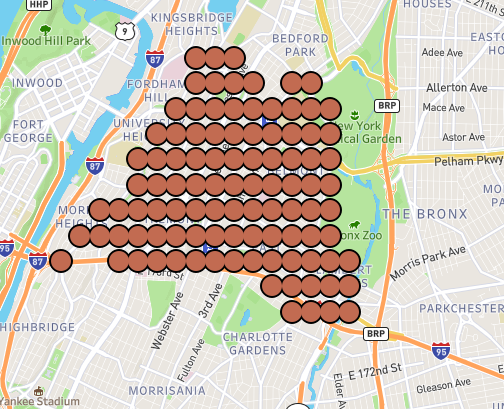

## Citi Bike Data Analysis    
Analysis By Jonathan Rinko    
  

  

For this project, we will be using [SQLAlchemy](https://docs.sqlalchemy.org/en/13/), [Postgres](https://www.postgresql.org/), [Tableau](https://www.tableau.com/) and [Python](https://www.python.org/) to perform analysis and hopefully create some nice visuals in addition to illuminating some of the hidden secrets of the Citi Bike data. 
The data and information about the data can be found here: [Citi Bike Data](https://www.citibikenyc.com/system-data)

I downloaded the 2018 and 2019 data for analysis, and since December 2019 is not available yet, I will be using 23 csv files initially. 

Luckily, this data has been pre-processed to remove trips that are taken by staff as they service and inspect the system, trips that are taken to/from any “test” stations and any trips that were below 60 seconds in length (potentially false starts or users trying to re-dock a bike to ensure it's secure).

### Requirements

To start off, you’ll need to have installed Jupyter and set up a Postgres database. If you don’t have Jupyter installed on your local machine, you can get it up and running with pip. If you’ve previously installed Anaconda, you already have Jupyter installed.

This project will also be using two python packages to connect the database to the notebook:

SQLAlchemy - generates SQL statements from python
Psycopg2 - communicates your SQL statements to your Postgres database

Both of these packages can be installed from the command line with pip or conda:

pip install sqlalchemy psycopg2
conda install -y sqlalchemy psycopg2

I will be creating simple tables in pgAdmin to be manipulated with SQL in Postgres or using SQLalchemy.  

  

This has been done for all 23 csv's from Jan 2018- Nov 2019, making this a BIG dataset. (over 19 million rows to be exact)

Ok, we're all set. Let's analyze this data! 

### The final visuals can be seen here: 
[TableauDashboard](https://public.tableau.com/profile/jon4546#!/vizhome/CitiBikeStartStationTripCountsDashboard/Dashboard1?publish=yes)  
 
[Dashboard2](https://public.tableau.com/profile/jon4546#!/vizhome/UsertypeByGender/Dashboard1)

### Conclusions: 

### Interesting Phenomenom discovered: 
1. According to the data, there are riders older than any living human. See: 
[Oldest Living People](https://en.wikipedia.org/wiki/List_of_the_oldest_living_people).       
 
2. There are many null values, which were excluded from the visualizations, and they seem to be clustered in the same geographical location, indicating these may be caused by a maintenance or testing facility or the animals at the bronx zoo stole a few bikes and neatly lined them up in a checkerboard pattern. Hey, I'm not ready to rule out any hypothesis.  
    
 
3. There are many illogical trip durations exceeding 1 day, which may be an indication of stolen or forgotten bikes, improper returns something else entirely.  
 
4. It was interesting to see that male 51 year olds make up the largest rider group, and that females are disproportionately represented in both customer and subscriber categories. This has often been attributed to a lack of security, fear of harrassment/being a victim of a crime or difficulty carrying children or items such as purses.  
 
5. Also, we can see that the subscription program has been quite a success.  
 
This project may evole in time, but for now this was just intended to be a quick analysis to demonstrate Tableau, SQL and to explore the NYC Citi Bike Data.         
   
    
## Thanks again to Citi Bike for providing this great data analysis data set! 
  
        
 
 

